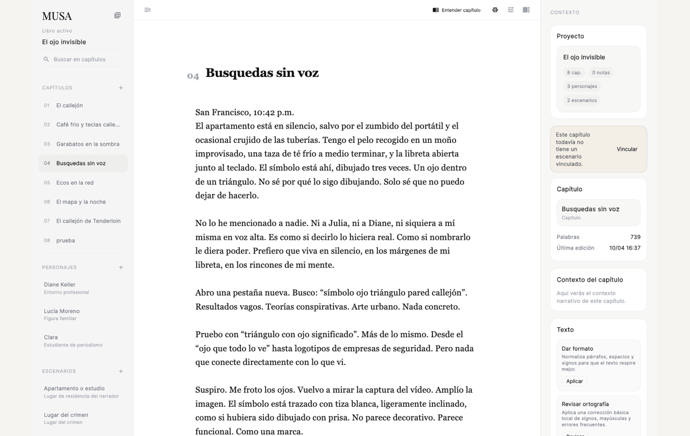
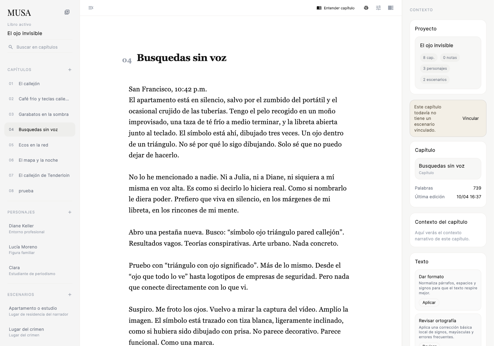
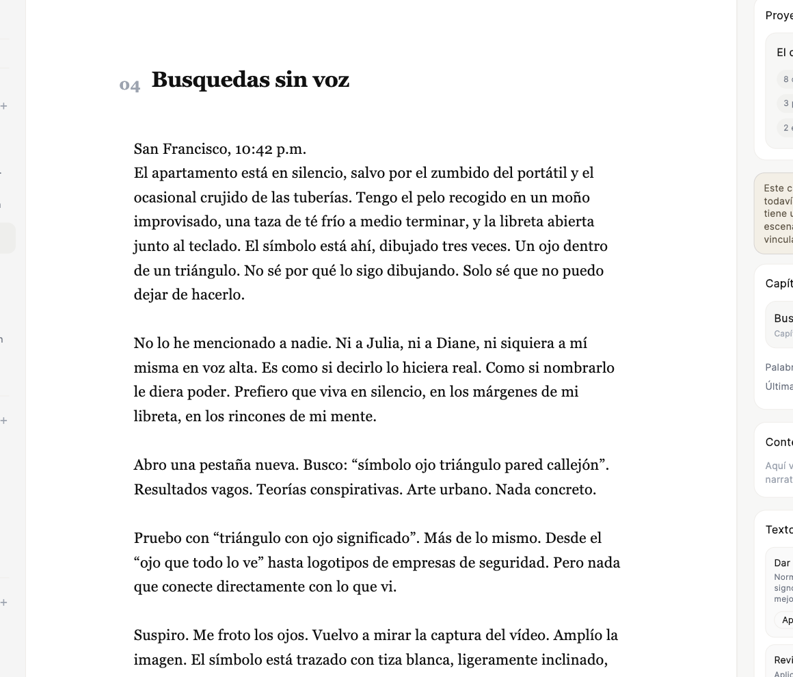
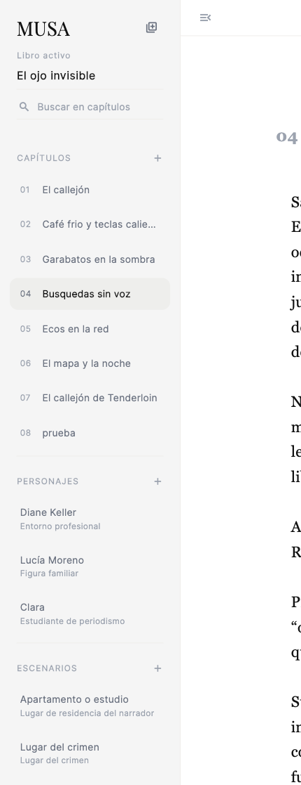
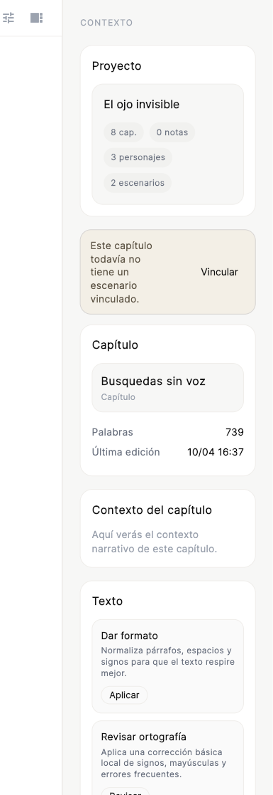
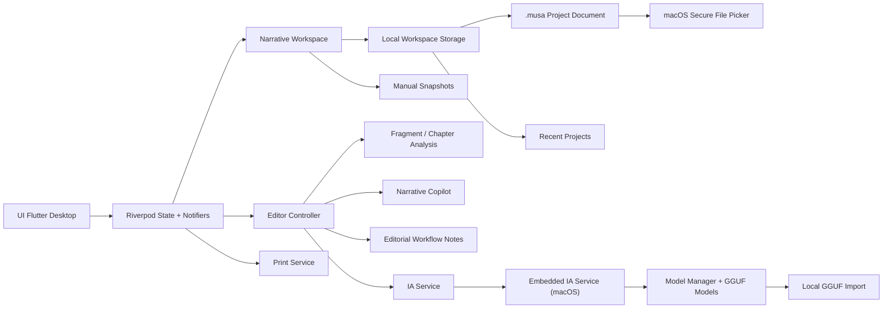
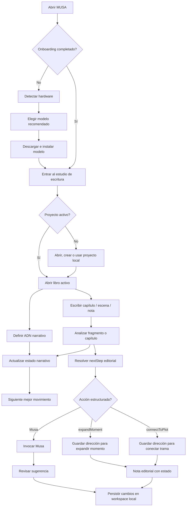
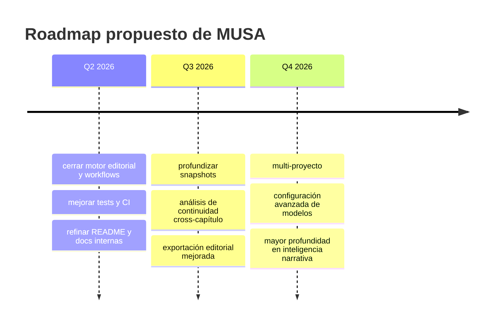

# MUSA

MUSA es una aplicación de escritura asistida por IA, local-first y orientada a proceso editorial. Está pensada como un estudio de escritura soberano: manuscrito, personajes, escenarios, notas, continuidad e inferencia conviven en una sola app de escritorio, con foco actual en macOS.

No es un simple editor con autocompletado. MUSA intenta actuar como una mesa de trabajo literaria donde el texto, el contexto narrativo y las intervenciones editoriales especializadas comparten el mismo espacio.

## Por qué este repositorio importa

MUSA es una pieza de portfolio pensada para demostrar criterio de producto, arquitectura y sensibilidad de usuario en un problema difícil: ayudar a escribir sin convertir la escritura en una caja negra dependiente de la nube.

El proyecto muestra capacidad para diseñar una experiencia completa, no solo pantallas sueltas:

- producto local-first con una tesis clara de privacidad, control y soberanía del autor,
- arquitectura Flutter + Riverpod organizada por dominio narrativo,
- persistencia portable mediante documentos `.musa`,
- integración de inferencia local con modelos `.gguf` y runtime nativo en macOS,
- flujos editoriales estructurados que convierten análisis en acciones reutilizables,
- UI de escritorio con manuscrito, inspector, navegación, revisión, impresión y música de foco,
- documentación de arquitectura, auditorías narrativas y memoria técnica del proyecto.

Como carta de presentación, MUSA comunica tres cosas: puedo construir software usable de extremo a extremo, puedo tomar decisiones técnicas con restricciones reales y puedo convertir una idea creativa en un producto con identidad defendible.

## Tesis del producto

La mayoría de editores con IA tratan el texto como un prompt. MUSA lo trata como una obra en progreso.

El manuscrito no vive aislado: está conectado a personajes, escenarios, notas, continuidad, ADN narrativo, memoria contextual, snapshots y decisiones editoriales. La IA no aparece como una capa genérica encima del editor, sino como un conjunto de musas con intención y alcance definidos.

La apuesta técnica es deliberada: privacidad por defecto, archivos locales, modelos instalados en la máquina y un flujo que sigue funcionando aunque no haya servicios externos disponibles.

## Vista rápida

Capturas reales del estado actual de la app.

### Recorrido visual



### Vista general



### Editor narrativo



### Navegación lateral



### Inspector contextual



## Qué aporta el proyecto

- Escritura asistida por IA local, sin depender de una API externa para el flujo principal.
- Arquitectura local-first con persistencia del workspace en disco.
- Organización narrativa por libro, capítulos, escenas, notas, personajes y escenarios.
- Musas especializadas para intervenir sobre estilo, claridad, ritmo y tensión.
- Análisis de fragmento y de capítulo para detectar foco narrativo, personajes, escenario y trayectoria.
- Herramientas de impresión/exportación editorial, incluyendo cuadernillo.
- Interfaz pensada para escritorio, con panel lateral, inspector contextual y overlays editoriales.

## Estado actual

El proyecto ya supera la fase de prototipo visual. Hay una base funcional clara en estos ejes:

- Onboarding con detección de hardware y selección de modelo local.
- Gestión de workspace narrativa persistida localmente.
- Proyectos `.musa` abribles, guardables y recordados como recientes.
- Apertura segura de proyectos `.musa` externos en macOS mediante picker nativo.
- Importación local de modelos `.gguf` ya descargados.
- Edición de manuscrito y entidades narrativas.
- Flujo de sugerencias editoriales con IA embebida en macOS.
- Análisis heurístico del texto para continuidad y ayudas contextuales.
- ADN narrativo del libro con género, escala, ritmo objetivo, prioridad y promesa de lectura.
- Copiloto narrativo con memoria narrativa, memoria contextual y siguiente mejor movimiento trazable.
- Workflows editoriales estructurados para expandir momentos y conectar trama.
- Notas editoriales con estado, origen de capítulo y dirección reutilizable.
- Mesa creativa por libro para ideas, bocetos, preguntas, research, imágenes y enlaces antes de convertirlos en material canónico.
- Bandeja de captura iPhone/Mac que convierte capturas rápidas en tarjetas creativas del libro activo sin contaminar manuscrito ni memoria narrativa.
- Snapshots manuales ligeros del workspace.
- Focus mode visual y modo máquina de escribir.
- Impresión de capítulos y libro completo en PDF.

Todavía hay recorrido en robustez, packaging, testing automatizado y documentación operativa de producción.

## Principios del producto

### 1. Local-first

El workspace se guarda en disco y el modelo se instala en la máquina del autor. La propuesta de valor central es privacidad, latencia baja y control del entorno de escritura.

### 2. IA editorial, no IA invasiva

Las musas no están diseñadas para secuestrar la voz del autor, sino para intervenir con intención delimitada: aclarar, tensar, pulir o afinar el ritmo sin desbordar el fragmento.

### 3. Contexto narrativo persistente

Libro, continuidad, tono, personajes, escenarios y documentos forman parte del contexto de trabajo. Eso permite que la IA no opere a ciegas sobre un bloque aislado de texto.

### 4. Flujo de escritorio

La experiencia está concebida para sesiones largas de escritura y revisión, con navegación lateral, inspector, análisis de capítulo y herramientas de impresión.

## Público objetivo

MUSA encaja especialmente bien en estos perfiles:

- Novelistas que trabajan manuscritos largos y necesitan continuidad entre capítulos.
- Autores que quieren ayuda editorial sin mover el texto a la nube.
- Editores o coautores que necesitan revisar estructura, tono y consistencia.
- Escritura de ficción con un ecosistema de personajes, escenarios y tensión narrativa.

## Arquitectura de alto nivel



## Flujo principal de producto



## Estructura funcional

### Núcleo de escritura

- Manuscrito por documentos con soporte para capítulos, escenas y borradores.
- Edición centrada en texto, con overlay y panel de sugerencias.
- Revisión con propuesta generada, comparación y aceptación/rechazo.

### Contexto narrativo

- Libros con metadatos, sinopsis y notas de tono.
- ADN narrativo por libro: género, subgénero, escala, ritmo objetivo, prioridad dominante, promesa de lectura y tipo de final.
- Personajes vinculables a documentos.
- Escenarios vinculables a documentos.
- Notas y memorias de voz dentro del workspace.
- Estado de continuidad asociado al libro activo.
- Señales ligeras de continuidad por capítulo desde el inspector.
- Memoria narrativa ligera con preguntas abiertas, pistas, amenazas, hechos importantes y cambios recientes de personaje.
- Memoria contextual separada para reglas de mundo, restricciones, hallazgos de investigación y conceptos persistentes.
- Estado de historia con acto, función de capítulo, tensión global, ritmo percibido y siguiente mejor movimiento.
- Snapshots manuales para guardar estados del libro sin introducir versionado complejo.

### Mesa creativa y captura

- Tarjetas creativas por libro para ideas, bocetos, preguntas, research, personajes, escenarios e imágenes.
- Estados de trabajo: inbox, explorando, prometedoras, listas, convertidas y archivadas.
- Detalle de tarjeta con edición de título, cuerpo, tipo, estado, tags, adjuntos y vínculos a entidades del libro.
- Entrada desde bandeja local `MUSA-Inbox/` para que iPhone o Mac depositen capturas JSON.
- Captura iPhone con intención editorial explícita: idea, boceto, pregunta o research.
- Conversión desde bandeja Mac a tarjeta creativa, conservando origen, tipo sugerido, enlace y referencia de adjunto.
- Las tarjetas permanecen como antesala no canónica hasta una conversión o acción explícita del autor.

### IA editorial

- Modelos locales descargables durante onboarding.
- Importación de modelos `.gguf` existentes desde archivo local.
- Reconciliación de modelos ya presentes en `Application Support`.
- Servicio IA embebido para macOS.
- Musas con reglas editoriales específicas.
- Flujo de sugerencias sobre selección o pasaje activo.

### Análisis automatizado

- Detección heurística de narrador.
- Detección de personajes y escenarios presentes en un fragmento.
- Análisis de capítulo por fragmentación interna.
- Resolución de momento dominante, función del capítulo y siguiente paso sugerido.
- Motor de `nextStep` con acciones estructuradas para `expandMoment` y `connectToPlot`.
- Recomendaciones de copiloto sensibles a género para thriller, ciencia ficción y fantasía.
- Clasificación heurística de documentos para evitar que investigación, worldbuilding o material técnico contaminen el estado narrativo.
- Compuertas de calidad para rechazar contexto débil antes de convertirlo en recomendación editorial.
- Filtro de ruido visible para evitar entidades no defendibles en la UI.

### Workflows editoriales

- `expandMoment`: convierte una recomendación de desarrollo de escena en una nota estructural con dirección elegida.
- `connectToPlot`: permite conectar un capítulo con símbolo, consecuencia o personaje.
- Cada dirección queda persistida como nota editorial con origen, estado y tipo de workflow.
- Las notas pueden abrirse desde el inspector y marcarse como usadas o descartadas.

### Salida editorial

- Impresión de capítulo.
- Impresión de libro completo.
- Generación de cuadernillo para revisión o lectura física.

## Las musas actuales

MUSA define cuatro perfiles editoriales principales:

- `Musa de Estilo`: mejora cadencia, precisión léxica y elegancia verbal.
- `Musa de Tensión`: intensifica fricción dramática y amenaza implícita.
- `Musa de Ritmo`: reorganiza respiración, pausas y flujo del texto.
- `Musa de Claridad`: elimina ambigüedad innecesaria sin aplanar la voz.

Cada musa incorpora:

- intención editorial explícita,
- reglas de intervención,
- recordatorio de alcance,
- límite de expansión del pasaje,
- mensajes de thinking/streaming para el panel de revisión.

## Módulos principales del código

### App shell

- `lib/main.dart`
- `lib/ui/layout/main_screen.dart`
- `lib/ui/widgets/sidebar.dart`
- `lib/ui/widgets/inspector.dart`

### Dominio editorial y workspace

- `lib/modules/books/`
- `lib/modules/manuscript/`
- `lib/modules/characters/`
- `lib/modules/scenarios/`
- `lib/modules/notes/`
- `lib/shared/storage/local_workspace_storage.dart`
- `lib/shared/storage/musa_project_document.dart`
- `lib/shared/storage/project_document_picker.dart`
- `lib/shared/storage/macos_secure_file_picker.dart`

### Editor e inferencia

- `lib/editor/controller/editor_controller.dart`
- `lib/editor/services/fragment_analysis_service.dart`
- `lib/editor/services/chapter_analysis_service.dart`
- `lib/editor/widgets/suggestion_review_panel.dart`
- `lib/editor/widgets/chapter_insight_panel.dart`
- `lib/modules/books/models/narrative_copilot.dart`
- `lib/modules/books/services/narrative_document_classifier.dart`
- `lib/modules/books/services/contextual_memory_updater.dart`
- `lib/modules/books/services/narrative_memory_updater.dart`
- `lib/modules/books/services/story_state_updater.dart`
- `lib/modules/books/services/next_best_move_service.dart`

### IA local

- `lib/services/ia_providers.dart`
- `lib/services/ia/embedded/`
- `lib/services/ia/embedded/management/model_manager.dart`
- `lib/services/ia/embedded/management/model_catalog.dart`

### Impresión

- `lib/services/print/print_service.dart`

### Shell adaptativo y documentación interna

- `lib/app/adaptive/`
- `lib/app/shells/desktop/`
- `lib/app/shells/ipad/`
- `lib/app/shells/iphone/`
- `docs/codebase_overview.md`
- `docs/mobile_adaptive_architecture.md`
- `docs/mobile_ipad_foundation_plan.md`
- `docs/ipad_compose_phase2_plan.md`
- `docs/narrative_copilot_audit.md`
- `docs/narrative_copilot_audit_report.md`
- `docs/narrative_copilot_audit_v15.md`

## Persistencia local

El workspace narrativo se guarda como un único documento de proyecto `.musa`
en el directorio de soporte de la aplicación. El documento es un contenedor
opaco y versionado para que el usuario no pueda borrar partes internas del
proyecto por accidente:

- archivo principal: `Musa.musa`
- ubicación base: `Application Support/musa/`

El manifiesto del proyecto guarda metadatos como formato, versión de esquema,
nombre de proyecto, libro activo y número de libros.

Cuando se abre un `.musa` externo en macOS, el picker nativo lee el archivo con
acceso seguro y MUSA copia el contenido a la ruta canónica local antes de
cargarlo. Eso evita depender de permisos temporales del sandbox para autosave y
recientes.

Las instalaciones con el formato anterior se migran automáticamente desde
`musa_workspace.json` al abrir la app.

El sistema genera un workspace semilla si no existe ninguno, con:

- un libro inicial,
- un capítulo de apertura,
- un estado base de continuidad,
- perfiles de musas,
- un perfil de modelo inicial.

Las notas estructurales y los snapshots se guardan dentro del mismo workspace local. Los snapshots son copias manuales ligeras: no hay branching, merge ni versionado complejo.

## Requisitos de desarrollo

### Entorno

- macOS
- Flutter SDK compatible con `>=3.3.0 <4.0.0`
- Xcode y toolchain para `flutter run -d macos`
- Homebrew recomendado para utilidades auxiliares

### Dependencias relevantes

- `flutter_riverpod`
- `google_fonts`
- `path_provider`
- `shared_preferences`
- `file_selector`
- `ffi`
- `printing`
- `pdf`

## Puesta en marcha

### 1. Obtener dependencias

```bash
flutter pub get
```

### 2. Ejecutar en macOS

```bash
flutter run -d macos
```

### 3. Ejecutar tests

```bash
flutter test
```

### 4. Analizar el proyecto

```bash
flutter analyze
```

## Manual de uso

### Primera apertura

1. Abre la app.
2. Completa el onboarding.
3. Deja que MUSA detecte el hardware del Mac.
4. Acepta el modelo recomendado o cambia a modo avanzado.
5. Descarga el modelo recomendado o importa un `.gguf` local compatible.
6. Entra al estudio de escritura.

### Flujo básico de escritura

1. Abre, crea o guarda un proyecto `.musa` desde el menú de proyecto de la barra superior.
2. Selecciona el libro activo desde la barra lateral.
3. Abre un capítulo o crea uno nuevo.
4. Escribe directamente en el editor.
5. Usa el inspector para enriquecer sinopsis, tono, personajes y escenarios vinculados.
6. Invoca una musa sobre el fragmento que quieras revisar.
7. Si el análisis propone `expandMoment` o `connectToPlot`, abre la dirección editorial y guárdala como nota.
8. Compara la sugerencia y decide si aceptarla o descartarla.

### Gestión de contexto narrativo

1. Crea o selecciona un libro.
2. Define sinopsis y notas de tono.
3. Define el ADN narrativo: género, escala, ritmo objetivo, prioridad y promesa de lectura.
4. Añade personajes.
5. Añade escenarios.
6. Vincula personajes y escenarios a capítulos o escenas.
7. Revisa la continuidad desde el panel derecho.
8. Atiende las señales ligeras del inspector cuando una entidad pesa en el capítulo pero no está vinculada.
9. Usa el estado narrativo y el siguiente mejor movimiento para decidir qué debe empujar la próxima escena.

### Gestión de proyectos

1. Usa `Abrir proyecto...` para cargar un archivo `.musa` existente.
2. Usa `Guardar como...` para convertir el workspace activo en un documento `.musa` independiente.
3. Usa `Crear proyecto nuevo...` para empezar un workspace limpio en una ubicación elegida.
4. Vuelve a proyectos recientes desde el mismo menú.
5. Usa `Usar proyecto local` para regresar al proyecto guardado en `Application Support/musa/`.
6. Si macOS bloquea un reciente externo, vuelve a seleccionarlo desde `Abrir proyecto...`.

### Gestión de modelos

1. Completa la detección de hardware en onboarding.
2. Descarga el modelo recomendado si quieres que MUSA gestione la instalación.
3. Si ya tienes el archivo `.gguf`, usa la importación local.
4. MUSA copia el modelo al directorio de soporte, valida el archivo y lo activa si coincide con el catálogo.

### Workflows editoriales

1. Analiza un capítulo.
2. Revisa el `nextStep` propuesto.
3. Abre la acción estructurada cuando sea `expandMoment` o `connectToPlot`.
4. Elige una dirección editorial.
5. MUSA crea una nota estructural vinculada al capítulo.
6. Desde el inspector puedes abrirla, marcarla como usada o descartarla.

### Mesa creativa

1. Abre el libro activo.
2. Entra en la mesa creativa del libro.
3. Crea tarjetas para ideas, bocetos, preguntas, research, imágenes o entidades posibles.
4. Mueve cada tarjeta por su estado de maduración.
5. Abre el detalle para añadir tags, adjuntos y vínculos.
6. Convierte una tarjeta en nota, personaje, escenario o documento cuando ya deba pasar al workspace canónico.

### Captura iPhone a tarjeta

1. Configura la carpeta local compartida de bandeja.
2. Desde la pantalla iPhone, escribe una idea, frase o enlace.
3. Marca la intención: idea, boceto, pregunta o research.
4. Guarda la captura en la bandeja.
5. En Mac, usa el popover para crear tarjeta rápidamente o abre la bandeja completa para corregir el tipo antes de crearla.
6. Si no hay libro activo, la captura queda pendiente y no se marca como procesada.

### Snapshots

1. Abre la vista del libro.
2. En el inspector, usa `Guardar` dentro de `Snapshots`.
3. Sigue escribiendo sin miedo a perder el estado anterior.
4. Restaura un snapshot si quieres volver a una versión guardada.

### Impresión editorial

1. Abre un capítulo con contenido o el libro activo.
2. Lanza la acción de imprimir.
3. Elige entre impresión normal o cuadernillo según el flujo disponible.
4. Revisa el PDF generado desde el diálogo de impresión del sistema.

## Casos de uso reales

### Caso 1. Reescritura estilística de un pasaje

Un autor tiene un párrafo funcional pero sin brillo. Selecciona el fragmento, invoca `Musa de Estilo` y revisa una propuesta más precisa sin perder intención narrativa.

### Caso 2. Ajuste de tensión en una escena plana

Una escena transmite información pero no sostiene la atención. `Musa de Tensión` interviene sobre el pasaje para introducir fricción, amenaza implícita y mejor pulso dramático.

### Caso 3. Revisión de claridad antes de compartir

Antes de enviar un capítulo a lectores cero, el autor usa `Musa de Claridad` para despejar ambigüedades innecesarias y mejorar comprensión sin simplificar en exceso.

### Caso 4. Construcción de biblia narrativa

Durante el desarrollo de una novela, el autor mantiene personajes, escenarios y notas vinculados al manuscrito para evitar contradicciones y conservar tono y relaciones.

### Caso 5. Revisión física en papel

Cuando el manuscrito necesita otra lectura, el autor imprime capítulo o cuadernillo para revisarlo fuera de pantalla con una maquetación legible.

### Caso 6. Dirección editorial persistente

El análisis detecta que un capítulo necesita desarrollar un momento o conectarse mejor con la trama. El autor elige una dirección en el sheet y MUSA la guarda como nota estructural, reutilizable y marcable como usada o descartada.

### Caso 7. Escritura sin miedo

Antes de una reescritura fuerte, el autor guarda un snapshot manual del libro. Puede probar cambios y restaurar el estado anterior si la dirección no funciona.

### Caso 8. Proyecto portable

El autor guarda una novela como `.musa`, la mueve a otra carpeta o disco, y puede reabrirla desde recientes sin depender del workspace interno de la app.

### Caso 9. Copiloto de dirección narrativa

El autor define que el libro es thriller, ciencia ficción o fantasía, añade una promesa de lectura y deja que MUSA proponga un siguiente mejor movimiento coherente con el género y el estado reciente del manuscrito.

## Diferenciadores frente a un editor genérico con IA

- El contexto narrativo no es accesorio; forma parte del modelo mental de la app.
- La IA trabaja con perfiles editoriales concretos, no con prompts genéricos opacos.
- El almacenamiento local y la instalación del modelo son parte explícita del producto.
- La continuidad, el capítulo y el fragmento tienen herramientas de análisis propias.
- Los `nextStep` importantes se convierten en acciones estructuradas, no solo consejos.
- El copiloto narrativo cruza ADN del libro, memoria reciente y señales de género para proponer una decisión breve.
- La memoria contextual permite usar reglas, restricciones y hallazgos sin contaminar el estado narrativo con documentos de apoyo.
- Los proyectos `.musa` permiten tratar cada novela como documento portable, no solo como estado interno de aplicación.
- La importación `.gguf` permite reutilizar modelos locales ya descargados.
- Las notas funcionan como sistema vivo de trabajo editorial.
- La mesa creativa separa ideas y material embrionario del canon narrativo hasta que el autor decide convertirlo.
- La bandeja iPhone/Mac permite capturar fuera del escritorio y crear tarjetas por libro sin sincronizar directamente el workspace.
- La salida editorial incluye impresión, no solo edición en pantalla.

## Limitaciones actuales

- El target principal hoy es macOS; ya existe base de arquitectura adaptativa para iPad/iPhone, pero no equivale todavía a una distribución final móvil.
- La robustez del motor IA depende del modelo instalado y del hardware disponible.
- El análisis narrativo actual es mayoritariamente heurístico; no sustituye lectura editorial humana.
- La continuidad actual es light: señala actividad y vínculos básicos, no contradicciones globales profundas.
- El copiloto narrativo es V1 heurístico y requiere auditoría editorial con muestras reales por género.
- La memoria contextual sigue siendo heurística; las auditorías V1.4/V1.5 muestran que necesita compuertas estrictas para evitar falsos positivos.
- La importación de modelos depende de que el archivo coincida con nombres y hashes esperados en el catálogo.
- La captura iPhone actual guarda texto, enlaces e intención editorial; no copia media al `.musa`, no reproduce audio y no transcribe notas de voz.
- Faltan más tests de integración y validación de regresiones en flujos complejos.
- El README documenta el estado observable del código, no una distribución empaquetada para usuarios finales.

## Próximas features sugeridas

### Producto

- Archivado y organización avanzada de proyectos recientes.
- Historial editorial más profundo sobre los snapshots actuales.
- Exportación adicional a formatos editoriales más allá de impresión.
- Panel de continuidad más profundo con conflictos abiertos y alertas cross-capítulo.
- Modo de revisión por escenas, no solo por capítulo.

### IA

- Selección manual y benchmarking de modelos desde ajustes.
- Pipeline multi-musa con estrategias combinadas.
- Memoria editorial persistente por libro y por personaje.
- Análisis de arco de personaje y evolución de tensión a nivel de libro.
- Auditoría editorial del copiloto narrativo con 20-30 salidas reales por género.
- Persistencia pública de la clasificación de documentos si la heurística demuestra estabilidad.
- Detección de contradicciones entre capítulos.

### Operación técnica

- Mejor cobertura de tests.
- CI estable para análisis, test y build de macOS.
- Empaquetado reproducible para distribución interna.
- Telemetría local opcional para rendimiento y fallos.

## Roadmap recomendado



## Estrategia técnica recomendada

Si el objetivo es llevar MUSA a una versión sólida de uso diario, el orden lógico sería:

1. Blindar persistencia, tests y estabilidad del flujo editor.
2. Consolidar el motor IA local y su gestión de modelos.
3. Profundizar el sistema de continuidad y análisis narrativo.
4. Mejorar distribución, empaquetado y documentación para usuarios no técnicos.

## Para contribuir

Antes de tocar arquitectura o añadir features nuevas, conviene revisar:

- shell de la app y layout principal,
- notifiers del workspace,
- controller del editor,
- servicios de análisis,
- gestión de modelos locales.

Flujo recomendado:

1. `flutter pub get`
2. `flutter analyze`
3. `flutter test`
4. validar manualmente en `macos`

### Changelog

Cada cambio relevante de producto, arquitectura, documentación o flujo de desarrollo debe actualizar [`CHANGELOG.md`](./CHANGELOG.md) antes de hacer commit.

Regla práctica:

1. documentar primero en `Unreleased`,
2. mover a una fecha o versión cuando se prepare una entrega,
3. omitir solo cambios triviales que no alteren comportamiento, contrato público ni documentación útil.

## Referencias rápidas

- Entrada principal: [`lib/main.dart`](./lib/main.dart)
- Layout principal: [`lib/ui/layout/main_screen.dart`](./lib/ui/layout/main_screen.dart)
- Persistencia local: [`lib/shared/storage/local_workspace_storage.dart`](./lib/shared/storage/local_workspace_storage.dart)
- Documento `.musa`: [`lib/shared/storage/musa_project_document.dart`](./lib/shared/storage/musa_project_document.dart)
- Selector de proyectos: [`lib/shared/storage/project_document_picker.dart`](./lib/shared/storage/project_document_picker.dart)
- Picker seguro macOS: [`lib/shared/storage/macos_secure_file_picker.dart`](./lib/shared/storage/macos_secure_file_picker.dart)
- Controlador del editor: [`lib/editor/controller/editor_controller.dart`](./lib/editor/controller/editor_controller.dart)
- Workflows de capítulo: [`lib/editor/widgets/chapter_insight_panel.dart`](./lib/editor/widgets/chapter_insight_panel.dart)
- Copiloto narrativo: [`lib/modules/books/models/narrative_copilot.dart`](./lib/modules/books/models/narrative_copilot.dart)
- Modelo de tarjetas creativas: [`lib/modules/creative/models/creative_card.dart`](./lib/modules/creative/models/creative_card.dart)
- Capturas de bandeja: [`lib/modules/inbox/models/inbox_capture.dart`](./lib/modules/inbox/models/inbox_capture.dart)
- Pantalla iPhone de captura: [`lib/ui/inbox/iphone/capture_screen.dart`](./lib/ui/inbox/iphone/capture_screen.dart)
- Popover de bandeja Mac: [`lib/ui/inbox/popover/inbox_popover.dart`](./lib/ui/inbox/popover/inbox_popover.dart)
- Clasificador narrativo: [`lib/modules/books/services/narrative_document_classifier.dart`](./lib/modules/books/services/narrative_document_classifier.dart)
- Memoria contextual: [`lib/modules/books/services/contextual_memory_updater.dart`](./lib/modules/books/services/contextual_memory_updater.dart)
- Siguiente mejor movimiento: [`lib/modules/books/services/next_best_move_service.dart`](./lib/modules/books/services/next_best_move_service.dart)
- Snapshots: [`lib/modules/books/models/workspace_snapshot.dart`](./lib/modules/books/models/workspace_snapshot.dart)
- Modelos locales: [`lib/services/ia/embedded/management/model_manager.dart`](./lib/services/ia/embedded/management/model_manager.dart)
- Impresión: [`lib/services/print/print_service.dart`](./lib/services/print/print_service.dart)
- Arquitectura adaptativa: [`docs/mobile_adaptive_architecture.md`](./docs/mobile_adaptive_architecture.md)
- Auditoría del copiloto: [`docs/narrative_copilot_audit.md`](./docs/narrative_copilot_audit.md)
- Reporte de auditoría del copiloto: [`docs/narrative_copilot_audit_report.md`](./docs/narrative_copilot_audit_report.md)
- Auditoría V1.5 del copiloto: [`docs/narrative_copilot_audit_v15.md`](./docs/narrative_copilot_audit_v15.md)
- Herramienta de auditoría: [`tool/audit_narrative_copilot.dart`](./tool/audit_narrative_copilot.dart)

## Resumen

MUSA ya tiene una identidad clara: no quiere competir como un editor genérico, sino como una herramienta editorial local, sobria y especializada para narrativa. El valor del proyecto está en unir manuscrito, contexto narrativo e IA de asistencia dentro de un flujo de escritorio serio.
